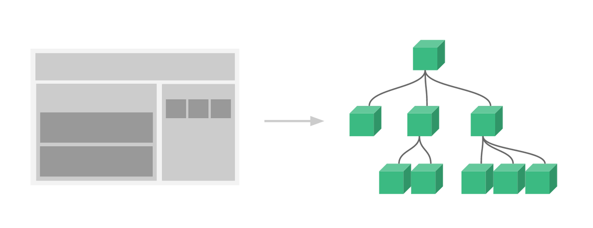
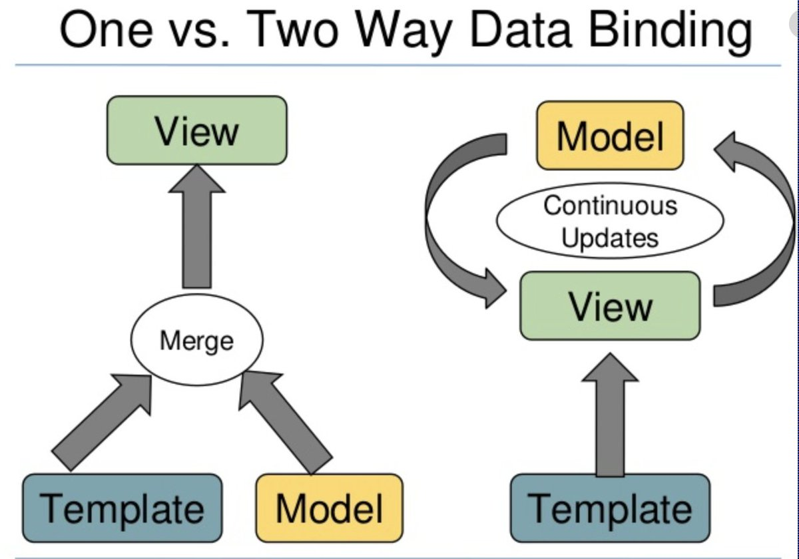
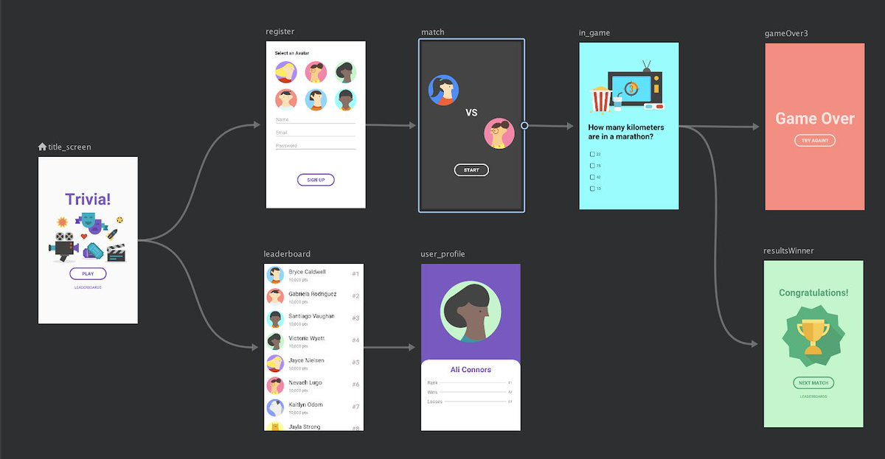
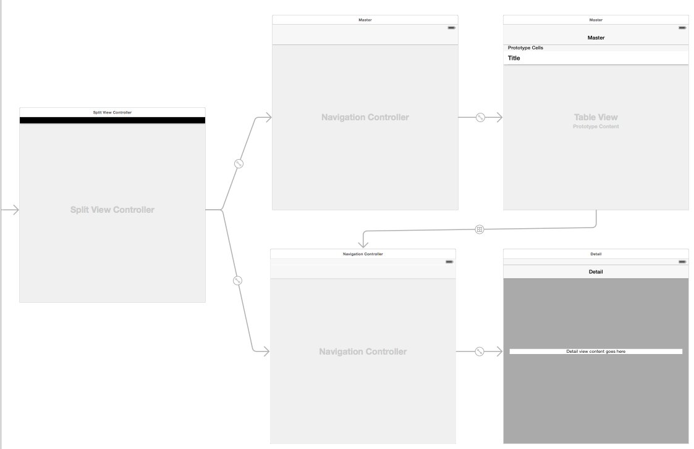
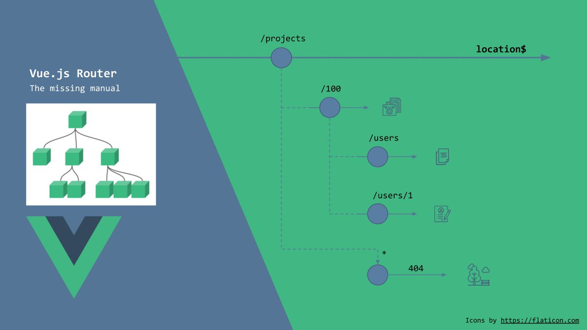

---
author: "Arnav Gupta 😷 💉🟢 💉🟢"
handle: "@championswimmer"
source: "https://twitter.com/championswimmer/status/1394898131926458371"

Are you an Android developer? iOS developer ? Or maybe you're into web ? Using React or Vue ? Or even Angular ? 
Flutter, sure. React Native ? Come on over let's talk. 

I have built/contributed to production apps using all above technologies. And here is a 🧵 👇

Small disclaimer: While I have worked with multiple mobile and web frontend frameworks, I have spent 10+ years on Android, and have written 2 very popular VueJS libraries. So maybe some of this can be biased towards that.

The first rule of frontend development: Do not get married to your framework. 
The second rule of frontend development: Do not get married to your framework. 

Zoom out a little bit. Most of frontend development is same, regardless of framework.

To be put more simply - all of frontend development is about 3 things 

- breaking down into reusable components
- state management (this is a bitch) 
- routing 

From a purist's perspective, routing is part of the state management problem, but still...

Third rule about frontend development - If you feel a framework is choking you. You are unable to "think" in a certain framework. Quit. Try another one. 

For most problems, frameworks pick an opinion. 

Mutability 
Composability
Templatisation

There are no frameworks "better" than others *in general*, but there ARE frameworks "better" than other *for you*

Some people think in functional/composable way, they love 
- React
- Flutter 
- Jetpack Compose
- SwiftUI

Others in templates 
- Vue 
- Angular
- Android XML 
- XIB

From a language perspective, some langauges like Javascript are very flexible, and allow both highly functional as well as super object-oriented approaches

Again, you'll find those who swear by React classes and Vue 2.0 style. 

Others prefer React Hooks and Vue Composition API

Fourth rule of frontend development: Only think about components, state management and routing. 

Views are dumb. But they need to be broken down into smaller reusable pieces. 

Learn to look at a design prototype and immediately visualise a tree 

(love this in the Vuejs docs) [pic.twitter.com/pyP19Pk2ic](https://twitter.com/championswimmer/status/1394898153120223234/photo/1)

State management is a hard one - because most learning around it focuses too much on implementation. 

People learn Redux, MobX, VueX, RxJS/RxJava, LiveData, StateFlow, BloC and what not, before understanding the essentials of what state management is. 

MVC vs MVVM vs MVP 🤷🏻‍♂️🤦🏻‍♂️

State management from first principles is not hard. 

Model = data which actually triggers business logic 
View = representation of the data the user sees. 

In ideal world they should be same, but keeping them in sync is the fundamental job of frontend developers.

Understand what is two-way data flow and one-way data flow. Neither are bad or good. Situations demand one or the other. 

Implement accordingly. 

Do not become "immutable state" purists who start flame wars (some Flutter and React folks sadly are). [pic.twitter.com/LdGOywGkjS](https://twitter.com/championswimmer/status/1394898164197445632/photo/1)

Take a financial app. You make a transaction. It would want the transaction to actually take place on the bank's servers, and sync the data to your app's local data, and then show the updated $ values on frontend.

Twitter on the other hand updates the like count immediately you hit the heart button and then eventually syncs the API call to its backend, and if somehow it fails, it will revert the heart back from ♥ to ♡ and -1 the like count. 

Speed vs accuracy are product needs.

Learn to work with observable data structures - which you can tie to a view and keep auto updating. 
Learn also to work with non-observable data, where you need to wire the "onchanged" functionality yourself. 

At a primitive level nothing is "observable" by default.

Understand the cost of rendering a frame, and understand how big a *ripple* on the view does changing a data create ?

Will changing a variable trigger a render from the top of the view tree, or only the nearest required node ? 
Optimising for this is the single biggest perf hack

Rule five of frontend development: One page at time. 

Break down your user flows into pages. And then visualise the order in which they are traversed. 
Mentally you should be able to create graph of it. 

Many IDEs and tools can do it for you these days too [pic.twitter.com/oFOJ6jldLZ](https://twitter.com/championswimmer/status/1394904093844414464/photo/1)

Embrace URLs. Do not try to circumnavigate them. From the onset of making your project, URLs (and URIs) should be the backbone of navigation. 

URLs are... eponymously.. 'universal'. They can be shared across platforms, they get hyperlinked. They are very powerful.

Billion dollar companies exist like Branch[.]io because developers shit all over the place on understanding something as simple as the importance of URLs. 

A single link that takes to a particular location, whether on website, mweb, ios/androi app or desktop app is invaluable.

Apart from popups and modals and alert dialogs, almost every other state that the app currently is in should be reproducible via URLs. (Mobile developers have a cooler name called "deeplinks". Potato potato). 

The current URL *and* the backstack together are part of state too.

Rule number six of frontend development: No inspectors, no debuggers. 

No I don't mean to say do not use them. Some great people at Google have spent eons polishing tooling, whether it is in Android Studio, Chrome DevTools or now Flutter Inspector. Lots of respect, but...

There will be 2 very usual cases that occur. 

1. Unable to inspect UI. Some rendering - like via Skia on Android or Canvas on web cannot be inspected to smallest of details. 

2. Unable to debug. The moment you attach debugger, concurrency and threads behave differently.

Single most valuable tool for a frontend developer is to learn to debug issues when inspecting and debugging cannot happen. 

Fun fact - at a talk on how to create Vue plugins at VueConf 2 years back I used 2 hillarious examples 

Watch from 11:45

[youtu.be/6SqDehO0seU?t=…](https://youtu.be/6SqDehO0seU?t=705)

Spoiler for the above video: I showed a plugin that adds border: solid 1px red; to all elements in a Vue app, and another plugin that flashes the screen red for 50ms every time there is mutation to the state. 

Don't laugh - these are actually super useful debuging tools for me.

