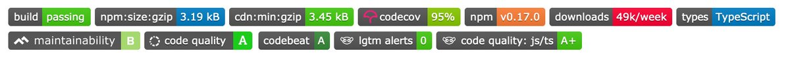

---
author: "Arnav Gupta 😷 💉🟢 💉🟢"
handle: "@championswimmer"
source: "https://twitter.com/championswimmer/status/1297182657197961216"

Arnav Gupta 😷 💉🟢 💉🟢 ([@championswimmer](https://twitter.com/championswimmer))

I have been teaching [[#FullStack](https://twitter.com/hashtag/FullStack) ](https://twitter.com/hashtag/FullStack)  [#WebDevelopment](https://twitter.com/hashtag/WebDevelopment)  for over 5 years, and taking interviews for #FullStack developers for over 3 years now. 
Here is a tiny thread 🧵 for aspiring [#Developers](https://twitter.com/hashtag/Developers)  👇

Arnav Gupta 😷 💉🟢 💉🟢 ([@championswimmer](https://twitter.com/championswimmer))

1. 📜 Take up frontend first, easier to see results. Take up backend later 

I personally learnt [#NodeJS](https://twitter.com/hashtag/NodeJS)  to support my [#Android](https://twitter.com/hashtag/Android)  work, and later got into [#Frontend](https://twitter.com/hashtag/Frontend) . But if I only had to be a web developer, I'll redo it with frontned first.

Arnav Gupta 😷 💉🟢 💉🟢 ([@championswimmer](https://twitter.com/championswimmer))

2.💡 Focus on basics before frameworks. Framework ninjas with 0 in basics get thrown out in interviews

It is nothing short of depressing how many people cannot even start making a simple project with [#react](https://twitter.com/hashtag/react)  or [#vue](https://twitter.com/hashtag/vue)  scaffolding. Don't be that guy. 
DOM events, semantic HTML ftw!

Arnav Gupta 😷 💉🟢 💉🟢 ([@championswimmer](https://twitter.com/championswimmer))

3. ⏱ It takes 5 hours to learn how to use Javascript. It takes 5 months to master the deeper intricacies of it

Interviews are going to go into - 
- 'this'
- prototypes
- closures
- Object.defineProperty
- ES6 classes
- event loop
- Promises
- async/await

Arnav Gupta 😷 💉🟢 💉🟢 ([@championswimmer](https://twitter.com/championswimmer))

4. 🔌 Servers aren't hard. Request = Input. Response = Output 

Everything in between those two things are just your plain-jane business logic you always have been doing. 

HTTP instead of console or GUI. That's it. Rest is the same. (no pun intended)

Arnav Gupta 😷 💉🟢 💉🟢 ([@championswimmer](https://twitter.com/championswimmer))

5. 🗄 You need to master both SQL and NoSQL DBs and know when to use what. NoSQL fanbois are the first to crash in interviews loaded with SQL questions 

Please don't be that guy - [mongodb-is-web-scale.com](http://www.mongodb-is-web-scale.com/)

Arnav Gupta 😷 💉🟢 💉🟢 ([@championswimmer](https://twitter.com/championswimmer))

6. 💼 After making at least 6-7 personal projects you will have 1-2 good enough for showing in interviews. 

How ever good your first project is, after making 5 more, that one will look trash. 
Less than 5 personal projects is Just Not Enough™

Arnav Gupta 😷 💉🟢 💉🟢 ([@championswimmer](https://twitter.com/championswimmer))

7. 🔗 If your project isn't hosted, then it is as good as never made. 

No one will go and look at your code, before they are impressed with the demo. Also what kind of developer are you if you cannot host your projects ?

Arnav Gupta 😷 💉🟢 💉🟢 ([@championswimmer](https://twitter.com/championswimmer))

8. 🚨 A Github project repository with CI/CD working, unit test and coverage badges will the clincher in interviews.

It should look no less than this 👇 [pic.twitter.com/mblH8h5yhU](https://twitter.com/championswimmer/status/1297182678152749056/photo/1)

Arnav Gupta 😷 💉🟢 💉🟢 ([@championswimmer](https://twitter.com/championswimmer))

9. ⚒ Basic DevOps knowledge (nginx, load balancing, caching) is always expected  

Needless to say, if you haven't used [#Linux](https://twitter.com/hashtag/Linux)  ever, you can forget grabbing half of the opportunities. 
Not trying to trash [#Windows](https://twitter.com/hashtag/Windows) , but let's be honest, everyone hosts on Linux.

Arnav Gupta 😷 💉🟢 💉🟢 ([@championswimmer](https://twitter.com/championswimmer))

10. 🔥 Benchmark yourself ➡️ full-stack blogging app / Twitter clone should take you &lt; 1 week. If not, more practice needed

Unless you can pump out a project over a weekend, forget trying to interview. Your first round will be a take home project.

